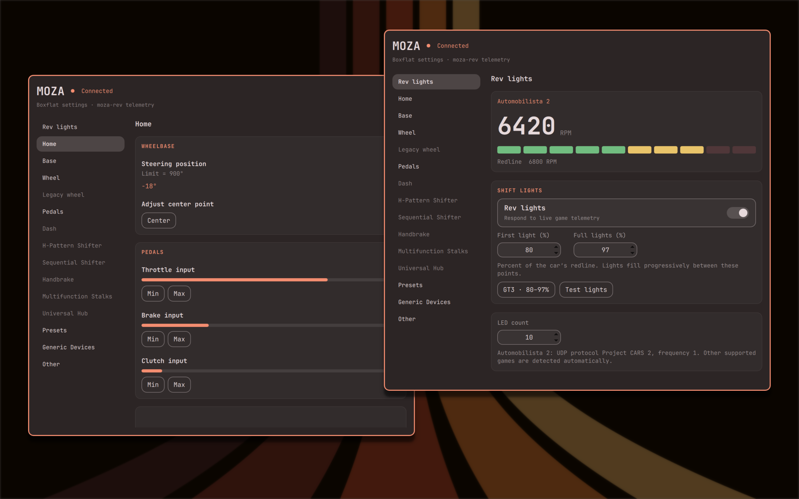
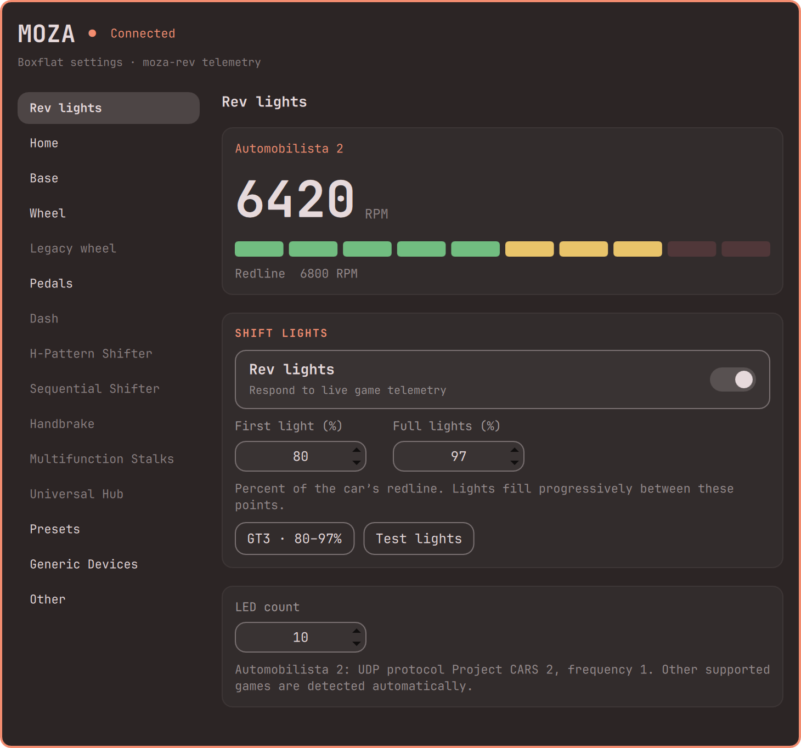
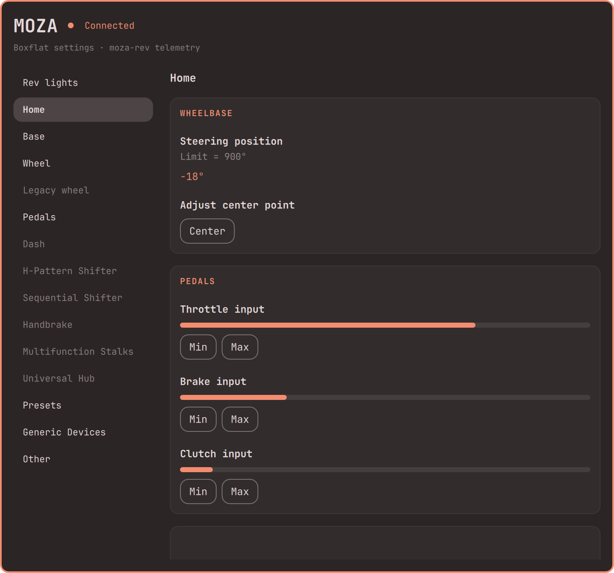
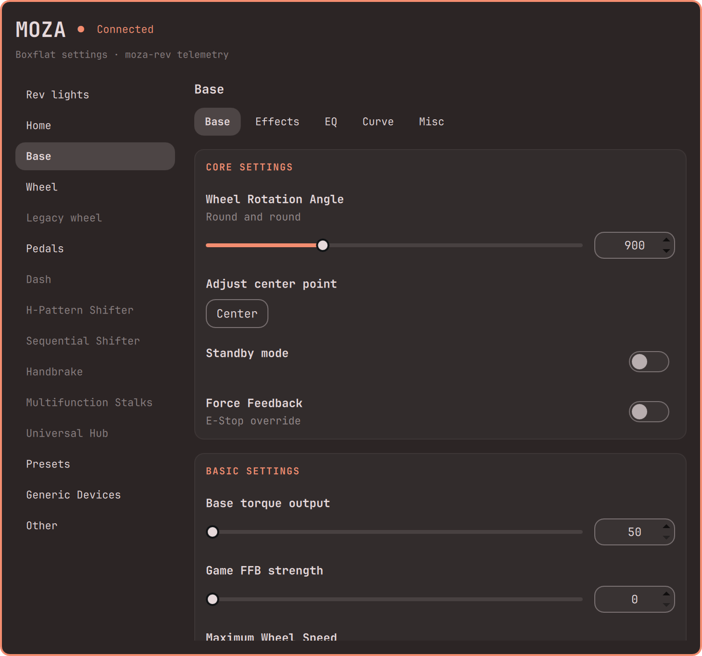

# MOZA for Omarchy

A native [Omarchy](https://omarchy.org) control panel for MOZA racing hardware.
It combines [Boxflat](https://github.com/Lawstorant/boxflat)'s Python settings
with fast Rust rev lights powered by [moza-rev](https://github.com/francisdb/moza-rev).
The themed interface follows [OmaStats](https://github.com/crmne/omastats).



The preview combines real plugin panels over Omarchy's Ristretto wallpaper,
in the same style as [hyprmoncfg](https://github.com/crmne/omarchy-hyprmoncfg).
Screenshots use simulated RPM and input values in an isolated capture host.
They do not represent a live game or additional hardware testing.

<details>
<summary>Rev lights, live inputs and wheelbase settings</summary>







</details>

## Features

- Live RPM, configurable first/full thresholds (80–97% by default), LED count,
  on/off, and a hardware sweep test. Changes apply without restarting.
- Wheelbase rotation, force feedback, damping, friction, inertia, protection,
  equalizer, force curve, soft limits, temperatures, and startup sound.
- Modern and legacy wheel settings: paddles, encoders, joystick modes,
  combinations, calibration, RPM/button colours, brightness, idle effects.
- Pedals, dashboards, H-pattern and sequential shifters, handbrakes,
  multifunction stalks and universal hubs, using Boxflat's existing controls.
- Boxflat presets with device selection, default profiles and automatic
  application when a game process starts. Preset dialogs stay inside the panel.
- Generic HID detection fixes and Boxflat's device-specific input behaviour.
- Wheel and pedal indicators update at up to 120 Hz while the panel is open.
- A steering-wheel bar icon that appears only while the wheelbase is connected.

Unavailable controls are hidden or disabled using Boxflat's capability checks.
This initial integration has been checked on an R12 with CS V2P (settings reads
and physical LED sweep). Other pages share Boxflat's logic and have adapter
coverage, but have not been tested on every hardware model. Firmware updates
are outside Boxflat's supported feature set.

## Install

Requires Omarchy's Quickshell plugin host and Python 3.12 or newer:

```sh
omarchy plugin add https://github.com/crmne/omarchy-moza.git --enable
```

On a fresh installation, open the steering-wheel icon and choose **Open setup
terminal**. It installs only the missing Boxflat dependencies and device-access
rules through an Omarchy terminal, which may ask for your password. The plugin
starts automatically afterward. Reconnect your devices if rules were installed.
Existing rules are preserved. You can retry interrupted setup from the panel.

The required Arch packages are `python-gobject`, `gtk4`, `libadwaita`,
`python-cairo`, `python-pyserial`, `python-yaml`, `python-evdev` and `python-psutil`.
There is no pip environment, separate Boxflat checkout or Rust compiler needed
for the standard x86-64 installation. [View the setup panel](screenshots/setup.png).

The repository bundles a reproducibly built, attested x86-64 Rust executable.
For another architecture, build on that machine before enabling the plugin:

```sh
git clone https://github.com/crmne/omarchy-moza.git
cd omarchy-moza
make build install
omarchy plugin enable crmne.moza
```

Building needs Rust, a C toolchain, pkg-config and libudev development files
(`rust`, `base-devel`, `systemd-libs` on Omarchy).

Close standalone Boxflat and stop standalone moza-rev first. They must not
compete for device replies or UDP ports. System packages and device rules are
installed only when you choose setup; nothing privileged runs at startup.

The steering-wheel icon appears when a wheelbase connects and disappears when
it disconnects. It also appears when first-run setup is needed. The background
service keeps watching for reconnection.
Click the icon in the bar, or run:

```sh
omarchy-shell crmne.moza show 'Rev lights'
omarchy-shell crmne.moza show Base
omarchy-shell crmne.moza status
omarchy-shell crmne.moza configure 80 97
```

## Games and settings

The Rust engine listens for Automobilista 2 / Project CARS, Wreckfest 2,
Codemasters legacy telemetry, BeamNG / OutGauge, Assetto Corsa and Forza.
Game setup and default ports follow moza-rev. For AMS2, select **Project CARS 2**
UDP and **frequency 1**. Linux can also need the broadcast-routing setup in
[moza-rev's documentation](https://github.com/francisdb/moza-rev).
Occupied telemetry ports are reported in the rev-light page.

Thresholds are percentages of redline. With a 6,800 RPM redline, 80–97% lights
the first LED at 5,440 RPM and fills the bar at 6,596 RPM.

Settings and Boxflat-compatible presets live in `~/.config/omarchy-moza/`
(or `$XDG_CONFIG_HOME/omarchy-moza/`). Existing standalone Boxflat settings
are left alone. Copy chosen `.yml` presets to `~/.config/omarchy-moza/presets/`
before starting the plugin to import them. Device settings are read from hardware.

The plugin runs while enabled, including with the panel closed. Boxflat's
standalone tray, window and autostart options are replaced by the plugin host.
Calibration, resets and profile loading retain Boxflat's behaviour. Colour
fields accept `#RRGGBB`; modern-wheel colours also update the telemetry palette.

```sh
omarchy plugin disable crmne.moza
omarchy plugin remove crmne.moza
```

Disabling releases the devices. Removal leaves settings and presets intact.

## Development and attribution

```sh
make test
make validate
make build
```

See [architecture and coverage](docs/Architecture.md) and
[binary provenance](docs/Binary-provenance.md). Screenshots can be reproduced
with the [isolated capture host](docs/Screenshots.md).

See [upstream tracking and repository history](docs/Upstreams.md) for source
pins, verification and the Boxflat update command. Boxflat lives unmodified in
`vendor/boxflat/`, while plugin adaptations live in `backend/`.

This repository retains Boxflat's source and history. The adapter uses its
actual Python controls and callbacks, without showing GTK windows; QML supplies
the visible interface. Rust owns the wheelbase connection and drives rev lights
directly. Python settings requests share that connection.

Boxflat is by Tomasz Pakuła and contributors (GPL-3.0). This integration uses
the same license. moza-rev is by Francis De Brabandere and contributors (MIT;
[notice](docs/moza-rev-LICENSE)). The grouped card component comes from Carmine
Paolino's OmaStats (MIT; [notice](docs/OmaStats-LICENSE)). Neither this project
nor Boxflat is affiliated with MOZA Racing.
